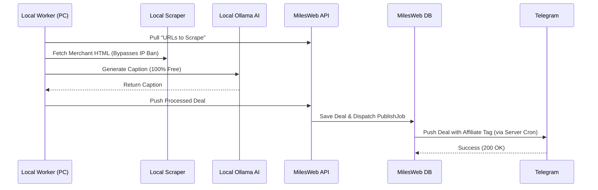

# Data Flow Sequence

**ID:** REQ-ARC-002
**Status:** Completed
**Last Updated:** 2026-06-29

## Deal Ingestion to Publishing Flow

```mermaid
sequenceDiagram
    participant LocalWorker as Local Worker (PC)
    participant Scraper as Local Scraper
    participant Ollama as Local Ollama AI
    participant API as MilesWeb API
    participant DB as MilesWeb DB
    participant Telegram

    LocalWorker->>API: Pull "URLs to Scrape"
    LocalWorker->>Scraper: Fetch Merchant HTML (Bypasses IP Ban)
    LocalWorker->>Ollama: Generate Caption (100% Free)
    Ollama-->>LocalWorker: Return Caption
    LocalWorker->>API: Push Processed Deal
    API->>DB: Save Deal & Dispatch PublishJob
    DB->>Telegram: Push Deal with Affiliate Tag (via Server Cron)
    Telegram-->>DB: Success (200 OK)
```
