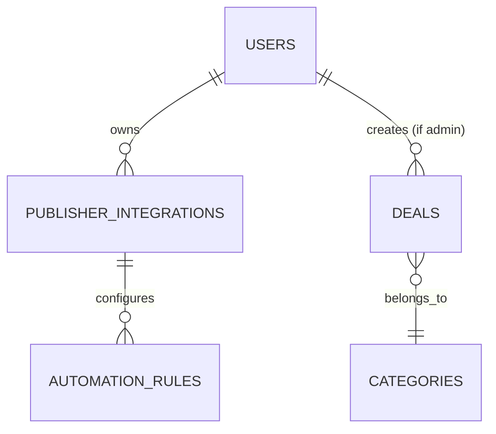

# Entity Relationship Diagram (ERD)

**ID:** REQ-DB-002
**Status:** Completed
**Last Updated:** 2026-06-29

## High-Level ERD

## Relationships
- A `User` (Publisher) can have multiple `Publisher_Integrations` (e.g., 1 Telegram, 1 Twitter).
- A `Publisher_Integration` can have multiple `Automation_Rules` (e.g., Rule 1: Electronics > 50% off, Rule 2: Fashion > 70% off).
